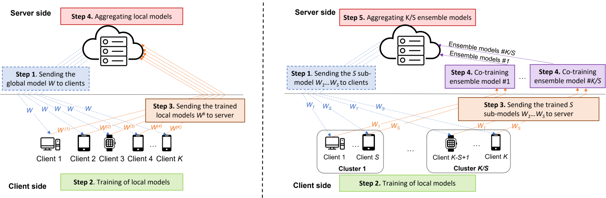

# Federated Divide and Cotraining

This repository contains the code and experiments for the paper: 

> [FedDCT: A Novel Federated Learning Approach
for Training Large Convolutional Neural Networks
on Resource-constrained Devices]()
>
> submitted to [ IEEE Journal of Selected Topics in Signal Processing](https://signalprocessingsociety.org/publications-resources/ieee-journal-selected-topics-signal-processing)

We propose FedDCT, a novel distributed learning paradigm that enables FL of large CNNs on resource-limited edge devices. Rather than training the entire large model on each client, following the divide-and-conquer strategy, FedDCT divides a single, large CNN network into several parallel partitions and co-trains it on multiple clients simultaneously. This strategy reduces the memory requirements and allows low-end devices to participate in the FL process.

We empirically conduct extensive experiments on standardized datasets, including CIFAR-10, CIFAR-100, and two real-world medical datasets HAM10000 and VAIPE. Experimental results show that FedDCT outperforms a set of current state-of-the-art FL methods with interesting convergence behaviors. Furthermore, compared to other state-of-the-art approaches, FedDCT achieves higher accuracy and substantially reduces the number of communication rounds (with 4-8 times fewer memory requirements) to achieve the desired accuracy on the testing dataset without incurring any extra cost on the server-side.


*Illustration of a typical FL architecture (left) and our proposed co-training perspective (right).*
## General Guidelines

We provide this codebase which contains:
* Training algorithms for 4 distributed collaborative machile learning algorithms: [FedAvg](https://arxiv.org/pdf/1602.05629.pdf), [FedProx](https://arxiv.org/abs/1812.06127), [SplitFed](https://arxiv.org/abs/2004.12088), our algorithm [FedDCT]() and normal centralized training.
* Training on 4 datasets : CIFAR10, CIFAR100, [HAM10000](https://www.kaggle.com/kmader/skin-cancer-mnist-ham10000) and [VAIPE](https://smarthealth.vinuni.edu.vn/resources/) dataset. To make this work reproducible and encourage new advances, we make all images and annotations of the VAIPE dataset publicly available as a part of a bigger dataset that we will release on our project [website](https://smarthealth.vinuni.edu.vn/resources/)
* This codebase is easy to extend to other FL algorithms, models and datasets.
* For hyperparameters, see `params/train_params.py`

## Preparations
### Dataset generation

To prepare CIFAR10 and CIFAR100 for training, you can just run the training script to allow for self downloading. For other datasets, please download to respective folder (i.e., download [HAM10000](https://www.kaggle.com/datasets/kmader/skin-cancer-mnist-ham10000) dataset to `dataset/ham10000` and unzip. )

The statistics of real federated datasets are summarized as follows.
<center>

| Dataset       | Devices         | Training Samples|Num classes <br> mean (stdev) |
| ------------- |-------------| -----| ---|
| CIFAR10      | 20 | 50000 | 10| 
| CIFAR100     | 20      |   50000 |100|
| HAM10000 | 20    |    8016 | 7|
| VAIPE| 20      |    8161 | 98|

</center>

### Downloading dependencies

```
Pytorch 1.10.2
OpenCV 4.5.5
```

## Run Experiments
(1) Please change the parameters in `config.py` correspondingly: purposes
```
HOME is the root folder, SPID is experiment name for logging 
```
(2) CIFAR10 Training scripts 
```
# Centralized Training 
python train_centralized.py  --is_fed=0 --split_factor=1 --dataset=cifar10 --num_classes=10 --is_single_branch=0 --is_amp=0 --arch=wide_resnet16_8 --epochs=300
# FedAvg
python train_fedavg.py --is_fed=1 --fixed_cluster=0 --split_factor=1 --num_clusters=20 --num_selected=20 --arch=wide_resnet16_8 --dataset=cifar10 --num_classes=10 --is_single_branch=0 --is_amp=0 --num_rounds=300 --fed_epochs=1 
# FedDCT
python train_feddct.py --is_fed=1 --fixed_cluster=0 --split_factor=4 --num_clusters=5 --num_selected=5 --arch=wide_resnetsl16_8 --dataset=cifar10 --num_classes=10 --is_single_branch=0 --is_amp=0 --num_rounds=300 --fed_epochs=1
#FedProx
python train_fedprox.py --is_fed=1 --fixed_cluster=0 --split_factor=1 --num_clusters=20 --num_selected=20 --arch=wide_resnet16_8 --dataset=cifar10 --num_classes=10 --is_single_branch=0 --is_amp=0 --num_rounds=300 --fed_epochs=1
#SplitFed
python train_splitfed.py --is_fed=1 --fixed_cluster=0 --split_factor=1 --num_clusters=20 --num_selected=20 --arch=wide_resnetsl16_8 --dataset=cifar10 --num_classes=10 --is_single_branch=0 --is_amp=0 --num_rounds=300 --fed_epochs=1
```
(3) CIFAR100 Training scripts 
```
# Centralized Training 
python train_centralized.py  --is_fed=0 --split_factor=1 --dataset=cifar100 --num_classes=100 --is_single_branch=0 --is_amp=0 --arch=resnet110 --epochs=650
# FedAvg
python train_fedavg.py --is_fed=1 --fixed_cluster=0 --split_factor=1 --num_clusters=20 --num_selected=20 --arch=resnet110 --dataset=cifar100 --num_classes=100 --is_single_branch=0 --is_amp=0 --num_rounds=650 --fed_epochs=1
# FedDCT
python train_feddct.py --is_fed=1 --fixed_cluster=0 --split_factor=4 --num_clusters=5 --num_selected=5 --arch=resnet110sl --dataset=cifar100 --num_classes=100 --is_single_branch=0 --is_amp=0 --num_rounds=650 --fed_epochs=1
#FedProx
python train_fedprox.py --is_fed=1 --fixed_cluster=0 --split_factor=1 --num_clusters=20 --num_selected=20 --arch=resnet110 --dataset=cifar100 --num_classes=100 --is_single_branch=0 --is_amp=0 --num_rounds=650 --fed_epochs=1
#SplitFed
python train_splitfed.py --is_fed=1 --fixed_cluster=0 --split_factor=1 --num_clusters=20 --num_selected=20 --arch=resnet110sl --dataset=cifar100 --num_classes=100 --is_single_branch=0 --is_amp=0 --num_rounds=650 --fed_epochs=1
```
(3) HAM10000 Training scripts 
```
# Centralized Training 
python train_centralized.py  --is_fed=0 --split_factor=1 --dataset=ham10000 --num_classes=7 --is_single_branch=0 --is_amp=0 --arch=wide_resnet50_2 --num_rounds=200 --crop_size=64 --lr=1e-2 --slow_start_lr=1e-3
# FedAvg
python train_fedavg.py --is_fed=1 --fixed_cluster=0 --split_factor=1 --num_clusters=20 --num_selected=20 --dataset=ham10000 --num_classes=7 --is_single_branch=0 --is_amp=0 --fed_epochs=1 --arch=wide_resnet50_2 --num_rounds=200 --crop_size=64 --lr=1e-2 --slow_start_lr=1e-3
# FedDCT
python train_feddct.py --is_fed=1 --fixed_cluster=0 --split_factor=4 --num_clusters=5 --num_selected=5 --arch=wide_resnetsl50_2 --dataset=ham10000 --num_classes=7 --is_single_branch=0 --is_amp=0 --num_rounds=200 --fed_epochs=1 --lr=1e-2 --slow_start_lr=1e-3 --crop_size=64
#FedProx
python train_fedprox.py --is_fed=1 --fixed_cluster=0 --split_factor=1 --num_clusters=20 --num_selected=20 --dataset=ham10000 --num_classes=7 --is_single_branch=0 --is_amp=0 --fed_epochs=1 --arch=wide_resnet50_2 --num_rounds=200 --crop_size=64 --lr=1e-2 --slow_start_lr=1e-3
#SplitFed
python train_splitfed.py --is_fed=1 --fixed_cluster=0 --split_factor=1 --num_clusters=20 --num_selected=20 --arch=wide_resnetsl50_2 --dataset=ham10000 --num_classes=7 --is_single_branch=0 --is_amp=0 --num_rounds=200 --fed_epochs=1 --lr=1e-2 --slow_start_lr=1e-3 --crop_size=64
```
(4) Tensorboard
```
# You can visualize the result using tensorboard 
tensorboard --logdir models/splitnet/
```
